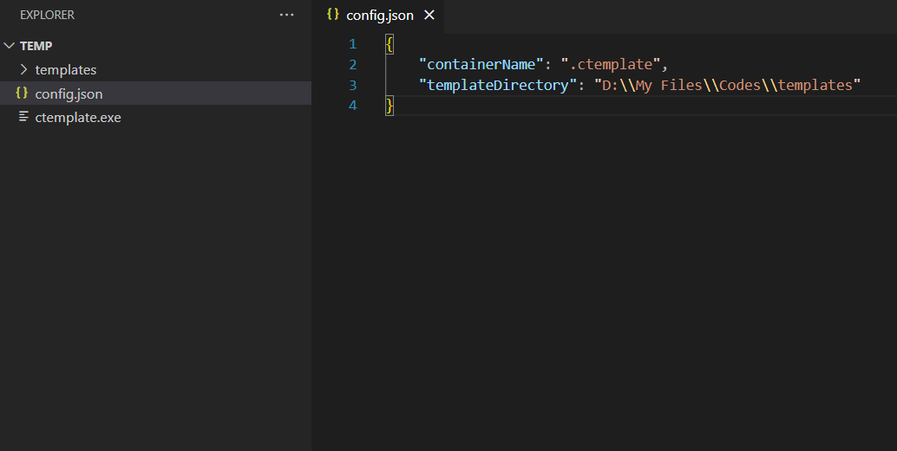
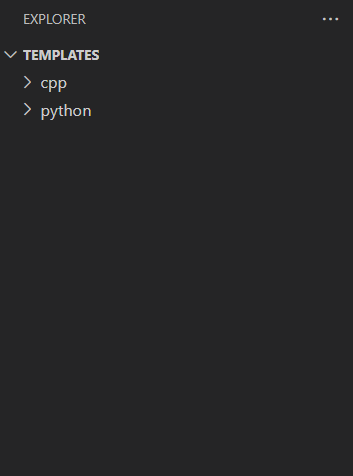
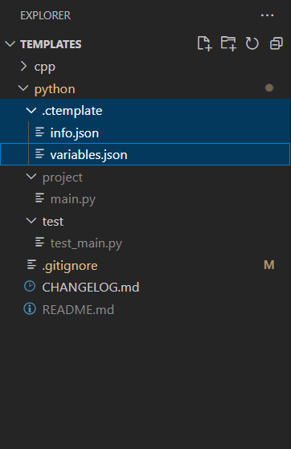
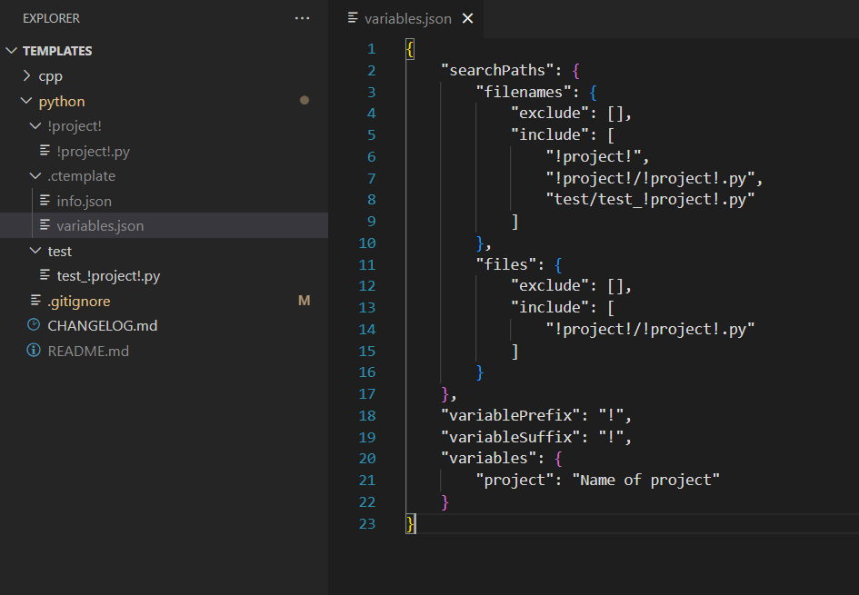
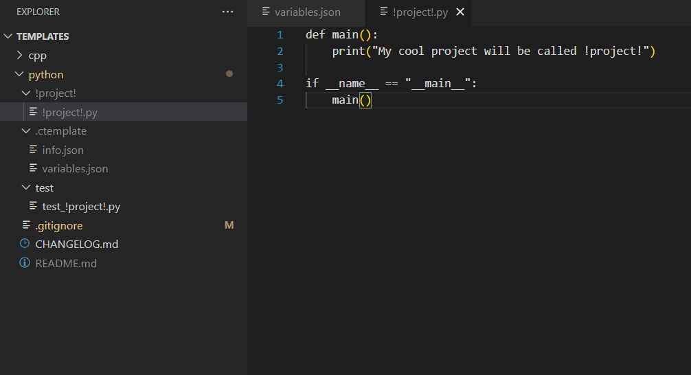

## Ctemplate
Create projects quickly and easily with this command-line utility.

<details>
   <summary>Table Of Contents</summary>
   <ol>
      <li>
         <a href="#about-the-project">About The Project</a>
         <ul>
            <li><a href="#features">Features</a></li>
            <li><a href="#built-with">Built With</a></li>
         </ul>
      </li>
      <li>
         <a href="#installation">Installation</a>
         <ul>
            <li><a href="#release-files">Release Files</a></li>
         </ul>
      </li>
      <li><a href="#setup">Setup</a></li>
      <li>
         <a href="#usage">Usage</a>
         <ul>
            <li><a href="#subcommands">Subcommands</a></li>
            <li><a href="#adding-a-template">Adding a template</a></li>
            <li><a href="#listing-templates">Listing templates</a></li>
            <li>
               <a href="#modifying-a-template">Modifying a template</a>
               <ul>
                  <li><a href="#template-configuration-functions">Template Configuration Functions</a></li>
               </ul>
            </li>
            <li><a href="#checking-templates">Checking templates</a></li>
            <li><a href="#initializing-a-template">Initializing a template</a></li>
         </ul>
      </li>
   </ol>
</details>

## About The Project

<p align="center">
  
</p>

This program was created to simplify the process of creating and configuring projects. Ctemplate was designed to quickly initialize project templates, making them ready to use right away.

### Features
- **Lightweight:** Only uses up 5MB at most.
- **Versatile:** Works with any programming language.
- **Self-Contained:** Works as a standalone executable.
- **User-Friendly:** No programming/scripting needed. Only basic JSON knowledge is required.
- **Parameterization:** Customize your template generation with variables.

### Built With
- [CLI11](https://github.com/CLIUtils/CLI11.git) - for parsing command-line arguments.
- [json](https://github.com/nlohmann/json.git) - for parsing and manipulating JSON files.
- [OS](https://github.com/Scrappyz/OS.git) - for file operations.
- [fmatch](https://github.com/Scrappyz/fmatch.git) - for pattern matching.
- [format](https://github.com/Scrappyz/format.git) - for formatting strings into tables.

## Installation
Ctemplate works as a standalone executable so all you need to do is download it then run it in your preferred terminal.

### Release Files
| File | Description |
| :--- | :--- |
| [ctemplate.exe](https://github.com/Scrappyz/Ctemplate/releases/download/v1.0.0-beta.1/ctemplate.exe) | Windows standalone executable (recommended for **Windows**) |

It is recommended to place the executable inside an empty directory.

## Setup
Upon first running the program, a `config.json` file will generate inside the directory. Open it with your preferred text editor then modify the `templateDirectory` to where you want your templates to be stored. 

<p align="center">
  
</p>

In my case, I want my templates to be stored in the `D:\My Files\Codes\templates` folder. It is recommended to use an absolute path in the `templateDirectory`.

Changing this configuration can also be achieved using the `config set` subcommand.

```
ctemplate config set templateDirectory="D:\My Files\Codes\templates"
```

#### Notes
- If a relative path is used in `templateDirectory`, the path to the template directory is relative to the executable.

## Usage
```
ctemplate [OPTIONS] [SUBCOMMAND]
```

### Subcommands
```
init                        Initialize a template
add                         Add a new template
remove                      Remove an existing template
list                        List all templates
info                        Show info about a template
config                      Show config
```

### Adding a template
This is achieved using the `add` subcommand.

```
Usage: ctemplate add [OPTIONS] [path]

Positionals:
  path TEXT                   Root project directory of
                              the template to be added
                              (defaults to the current path)

Options:
  -h,--help                   Print this help message and exit
  -n,--name TEXT REQUIRED     Name of the new template
  -a,--author TEXT            Author of the new template
  -d,--desc TEXT              Description of the new template
```

Create your template project then navigate to that project's root directory. Run the `add` subcommand then supply a name for the template with the `-n,--name` option. You can also add an author and description to that template with the `-a,--author` and `-d,--desc` respectively. The template will be then copied to your template directory (configured in the `config.json` file) with a new folder inside it (defaults as `.ctemplate`). This folder is where all the information about the template is stored.

### Listing templates
This is achieved with the `list` subcommand.

```
Usage: ctemplate list [OPTIONS]

Options:
  -h,--help                   Print this help message and exit
```

If you followed the steps correctly in the "[Adding a template](#adding-a-template)" section. The template you added should appear in the listed templates.

### Modifying a template
To modify a template, you need to go to your template directory (Use the `config` subcommand or go to your `config.json` to see your template directory).

<p align="center">
  
</p>

In the image above, I have two templates in my template directory: `cpp` and `python`. Open the template you want to edit, then go to the `.ctemplate` folder. The `.ctemplate` folder is where all the information about the template, such as its author, description, variables, etc., is stored. Each template inside the template directory should have its own `.ctemplate` folder to be recognized as a template.

<br>

<p align="center">
  
</p>

In the `.ctemplate` folder, there will be a few files inside it. There will be a `info.json` and a `variables.json`. The `info.json` is where we store the template's author and description. The `variables.json` is where we store information about the template's variables, such as where to search for them, what variable prefix and suffix to use, and what variables are valid.

<br>

<p align="center">
  
</p>

The `variables.json` will have these keys and values. With these settings, ctemplate will look for variables with the prefix and suffix of `!` (E.g: `!project!`) in the listed paths in `searchPaths`. To add a variable, place in a valid variable inside (in this case `project`) inside a file or filename then surround it with the prefix and suffix.

<br>

<p align="center">
  
</p>

I have already configured the `python` template to these settings by changing the `project` directory name to `!project!` or changing the `test/test_main.py` name to `test/test_!project!.py`. A text has also been changed inside the used to be `main.py`. All of these variables will be replaced upon template initialization.


#### Template Configuration Functions
1. `info.json`
   - `author`: Author of the template.
   - `description`: Description about the template.
2. `variables.json`
   - `variables`: These are the variables to look for. They can also be supplied with a description.
   - `variablePrefix`: The prefix to use for variables.
   - `variableSuffix`: The suffix to use for variables.
   - `searchPaths`: Paths where ctemplate will look for variables.
     - `filenames`: Paths where ctemplate will look for variables in filenames such as `!project!` or `"test/test_!project!.py"`.
     - `files`: Paths where ctemplate will look for variables inside files.

##### Notes
- All paths should be relative to the template project's root directory.
- Wildcards such as `*` are supported when adding paths.
- Variables need both a prefix and a suffix so `variablePrefix` and `variableSuffix` cannot be empty.

### Checking templates
This is achieved with the `info` subcommand.
```
Usage: ctemplate info [OPTIONS] template

Positionals:
  template TEXT REQUIRED      Template to get info from.
                              Use the 'list' subcommand to see available templates

Options:
  -h,--help                   Print this help message and exit
```

To check information about a template use:
```
ctemplate info "template_name"
```
Try replacing the "template_name" with a template in your template list.

### Initializing a template
This is achieved using the `init` subcommand. 

```
Usage: ctemplate init [OPTIONS] name

Positionals:
  name TEXT REQUIRED          Name of the template to initialize.
                              Use the 'list' subcommand to see available templates

Options:
  -h,--help                   Print this help message and exit
  -p,--path TEXT              Path to initialize the template to
                              (defaults to the current path)
  -f,--force                  Overwrites the entire directory
                              with the template
  -v,--variables TEXT ...     Set variable values
                              (E.g: projectName="Hello World")
  -i,--include TEXT ...       Paths to include in the
                              template when initializing
                              (E.g: "project/main.py")
  -e,--exclude TEXT ...       Paths to exclude in the
                              template when initializing
                              (E.g: "project/main.py")
```

If you have followed the previous sections correctly, you are now ready to initialize your template.

Use the `list` subcommand to see the templates you added. Then use the `info` subcommand to check its valid variables. To initialize it, use:
```
ctemplate init "template_name" -v var="your value"
```
Replace `template_name` with the name of your template then replace `var` with a valid variable. Every instance of that variable in the paths that has been listed in the `variables.json` file will be replaced with the value. If your template has multiple variables, `-v,--variable` is capable of multiple inputs (E.g: `-v var1="val1" var2="val2" var3="val3"`).